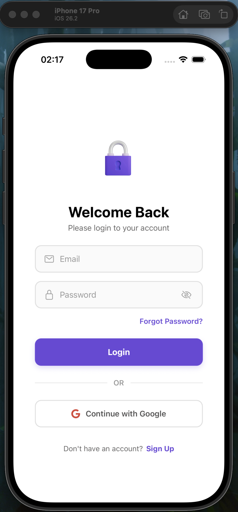
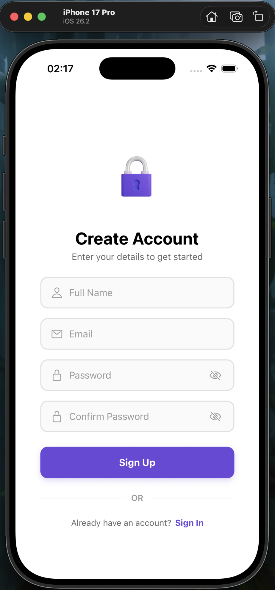
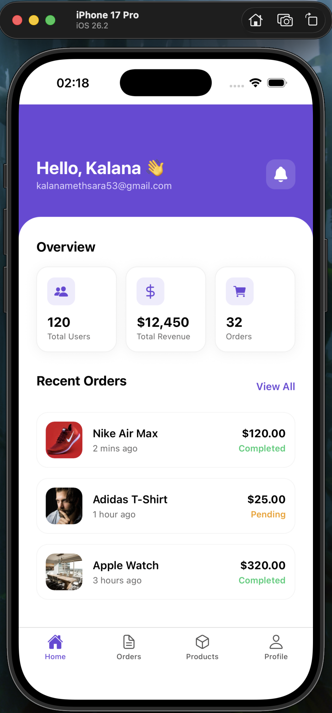
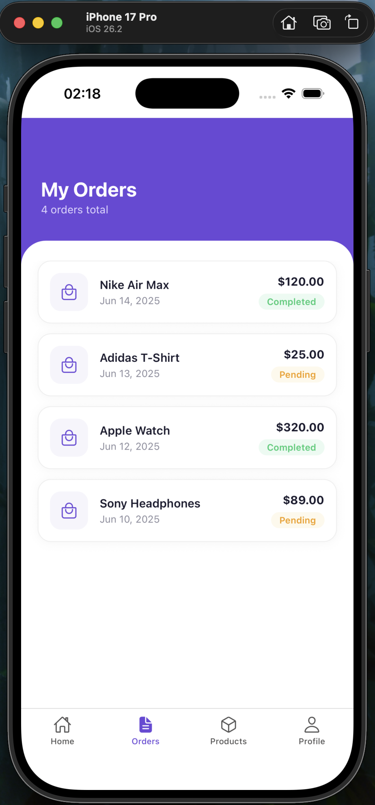
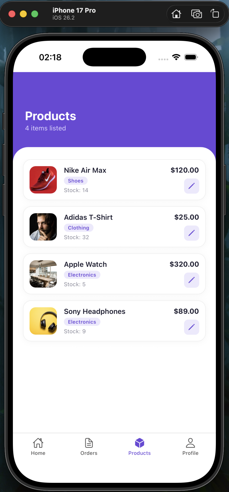
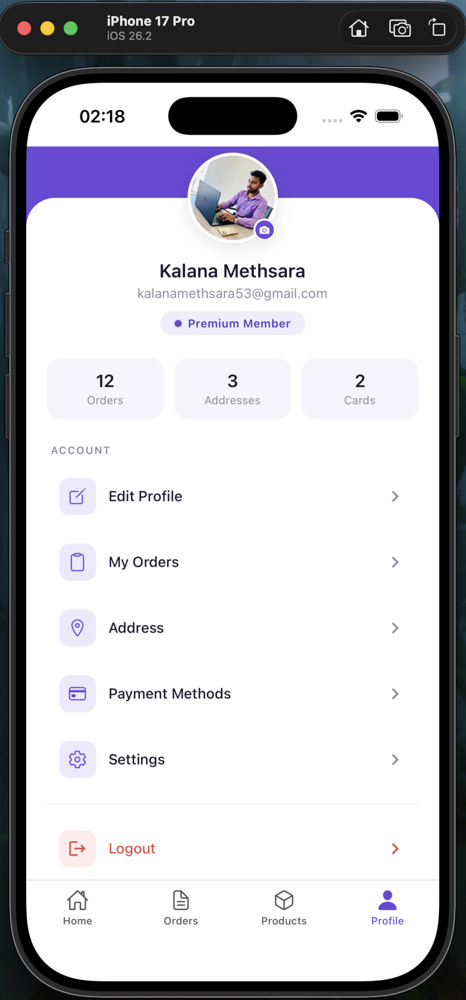

<div align="center">

# 📱 Mobile Admin Dashboard

### Built with React Native & Expo — My First Mobile App 🚀

[](https://reactnative.dev/)
[](https://expo.dev/)
[](https://www.typescriptlang.org/)
[](https://www.nativewind.dev/)

<br/>

> A fully functional cross-platform **Admin Dashboard** mobile app built as part of the Advanced Mobile Application Development (AMD) module at **IJSE**.

</div>

---

## 📸 Screenshots

<div align="center">
  
    
  
  
  
  
</div>
---

## ✨ Features

- 🏠 **Home Dashboard** — Live stats overview with Users, Revenue & Orders cards
- 📦 **Recent Orders** — Order list with Completed / Pending status badges
- 🛍️ **Product Management** — Products with category tags, stock info & edit actions
- 👤 **Profile Screen** — Stats row, account menu navigation & logout flow
- 🗂️ **File-based Routing** — Clean navigation with Expo Router
- 🎨 **Consistent Design System** — Purple brand theme (`#6B49D9`) across all screens

---

## 🛠️ Tech Stack

| Technology | Purpose |
|------------|---------|
| **React Native** | Cross-platform mobile framework |
| **Expo SDK 56** | Development toolchain & build system |
| **TypeScript** | Type-safe JavaScript |
| **Expo Router** | File-based navigation |
| **NativeWind** | Tailwind CSS for React Native |
| **@expo/vector-icons** | Ionicons, Feather, MaterialIcons |

---

## 📁 Project Structure

```
app/
├── (tabs)/
│   ├── index.tsx          # Home Dashboard
│   ├── orders.tsx         # Orders Screen
│   ├── products.tsx       # Products Screen
│   └── profile.tsx        # Profile Screen
├── _layout.tsx            # Root layout
assets/
├── images/
│   ├── dashboard.png
│   ├── orders.png
│   ├── products.png
│   └── profile.png
components/
└── ...
```

---

## 🚀 Getting Started

### Prerequisites

- Node.js 18+
- Expo CLI
- iOS Simulator / Android Emulator or Expo Go app

### Installation

```bash
# Clone the repository
git clone https://github.com/YOUR_USERNAME/YOUR_REPO_NAME.git

# Navigate into the project
cd YOUR_REPO_NAME

# Install dependencies
npm install

# Start the development server
npx expo start
```

### Run on Device

```bash
# iOS Simulator
npx expo run:ios

# Android Emulator
npx expo run:android

# Expo Go (scan QR code)
npx expo start
```

---

## 📚 Key Concepts Learned

- ✅ Mobile-first layout thinking with `SafeAreaView`, `FlatList`, and `flex`
- ✅ Component-based architecture with reusable cards & lists
- ✅ Dynamic styling with status-aware color logic
- ✅ File-based routing with Expo Router
- ✅ Consistent design tokens across all screens
- ✅ Platform-aware layout handling

---

## 🎥 Demo Video

▶️ [Watch on YouTube](YOUR_YOUTUBE_LINK)

---

## 👨‍💻 Author

**Kalana Methsara**
- 📧 kalanamethsara53@gmail.com
- 🎓 Graduate Diploma in Software Engineering — IJSE
- 💼 [LinkedIn](https://www.linkedin.com/in/YOUR_PROFILE)
- 🐙 [GitHub](https://github.com/YOUR_USERNAME)

---

## 📄 License

This project is open source and available under the [MIT License](LICENSE).

---

<div align="center">

⭐ If you found this helpful, please give it a star!

**Made with ❤️ and lots of ☕ by Kalana Methsara**

</div>